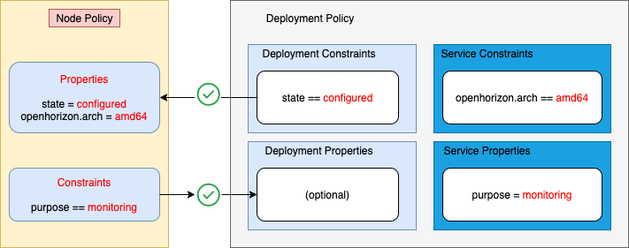
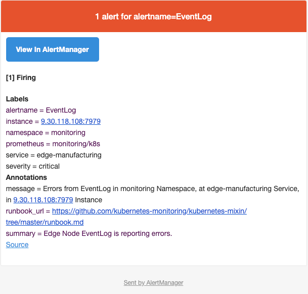

# Edge JSON Exporter
Edge Node JSON Exporter

This is a simple example of using and creating a JSON Exporter service.

- [Preconditions for Using the JSON Exporter Service](#preconditions)
- [Using the JSON Exporter Service with Deployment Policy](PolicyRegister.md)
- [Creating Your Own Prometheus-operator monitoring solution](CreateService.md)
- Further Learning - to see more Horizon features demonstrated, continue on to the [cpu2evtstreams example](../../evtstreams/cpu2evtstreams).

Additionally content will includes:

1. What is anax Event log API, what type of information is available on the Edge nodes
2. How can you expose Event Log information as Prometheus metrics using the JSON exporter
3. Configure rules in Prometheus to trigger alerts to AlertManager
4. Use AlertManager to send notifications to Edge administrators

## 1. Edge Node EventLog Rest API
Anax provides an Event Log rest API,

For example, List the event logs for the current or all registrations with:

`hzn eventlog list`


Event Log API source code is avaialble at:
[EventLog API](https://github.com/open-horizon/anax/blob/master/cli/eventlog/eventlog.go)

Here is an example of the information provided with `hzn eventlog list -l` command:

```
 {
    "record_id": "10",
    "timestamp": "2020-09-09 12:37:21 -0700 PDT",
    "severity": "error",
    "message": "Error starting containers: API error (500): driver failed programming external connectivity on endpoint 7996f592634d22c5583f74b0404cc77fd69969879fa5ec321e0cf2c70ef38043-acme-motion-detection-service-gpu (b3623ba8977d822fc4b0d47614e6cabb07b4f7d9b7004e5829aaa6440bb248d7): Bind for 0.0.0.0:9080 failed: port is already allocated",
    "event_code": "error_start_container",
    "source_type": "agreement",
    "event_source": {
      "agreement_id": "7996f592634d22c5583f74b0404cc77fd69969879fa5ec321e0cf2c70ef38043",
      "workload_to_run": {
        "url": "acme-motion-detection-service-gpu",
        "org": "ipcluster",
        "version": "1.0.0",
        "arch": "amd64"
      },
      "dependent_services": [],
      "consumer_id": "IBM/ipcluster-agbot",
      "agreement_protocol": "Basic"
    }
  }
```
Notice the `severity` and `message` content in the resulting JSON. This information will exported to Prometheus.

## 2. Exporting Edge Node Event Log data to Prometheus

The Prometheus development community has created a JSON Exporter to scrape remote JSON data by JSONPath. Source code is available on [Github](https://github.com/prometheus-community/json_exporter)

## 3. Configure rules in Prometheus to trigger alerts to AlertManager

The Prometheus ecosystem consists of multiple components, many of which are optional.

### Architecture

This diagram illustrates the architecture of Prometheus and some of its ecosystem components:


[architecture](https://prometheus.io/docs/introduction/overview/)

## <a id=preconditions></a> Preconditions for Using the JSON Exporter Service

If you have not done so already, you must do these steps before proceeding with the JSON Exporter service:

1. Install the Horizon management infrastructure (exchange and agbot).

	*Also see [one-click Management Hub installation example](https://github.com/open-horizon/devops/blob/master/mgmt-hub/README.md)

2. Install the Horizon agent on your edge device and configure it to point to your Horizon exchange.

3. As part of the infrasctucture installation process for IBM Edge Computing Manager a file called `agent-install.cfg` was created that contains the values for `HZN_ORG_ID` and the exchange and css url values. Locate this file and set those environment variables in your shell now:

```bash
eval export $(cat agent-install.cfg)
```

 - **Note**: if for some reason you disconnected from ssh or your command line closes, run the above command again to set the required environment variables.

4. In addition to the file above, an API key associated with your Horizon instance would have been created, set the exchange user credentials, and verify them:

```bash
export HZN_EXCHANGE_USER_AUTH=iamapikey:<horizon-API-key>
hzn exchange user list
```

5. Choose an ID and token for your edge node, create it, and verify it:

```bash
export HZN_EXCHANGE_NODE_AUTH="<choose-any-node-id>:<choose-any-node-token>"
hzn exchange node create -n $HZN_EXCHANGE_NODE_AUTH
hzn exchange node confirm
```

6. If you have not done so already, unregister your node before moving on:
 ```bash
hzn unregister -f
```

## <a id=using-JSON-exporter></a> Using the JSON Exporter Service with Deployment Policy


The Prometheus Operator for Kubernetes provides easy monitoring definitions for Kubernetes services and deployment and management of Prometheus instances.

This have been tested on a X84-64 Kubernetes cluster.

This repository collects Kubernetes manifests, Grafana dashboards, and Prometheus rules combined with documentation and scripts to provide easy to operate end-to-end Kubernetes cluster monitoring with Prometheus using the Prometheus Operator. The container images support AMD64, ARM64, ARM and PPC64le architectures.

The content of this project is written in jsonnet and is an extension of the fantastic kube-prometheus project.


Components included in this package:

The Prometheus Operator
Highly available Prometheus
Highly available Alertmanager
Prometheus node-exporter
kube-state-metrics
CoreDNS
Grafana
SMTP relay to Gmail for Grafana notifications (optional)

[Cluster Monitoring](https://github.com/carlosedp/cluster-monitoring)

## Quickstart for K3S
To deploy the monitoring stack on your K3s cluster, there are four parameters that need to be configured in the vars.jsonnet file:

1. Set k3s.enabled to true.
2. Change your K3s master node IP(your VM or host IP) on k3s.master_ip parameter.
3. Edit suffixDomain to have your node IP with the .nip.io suffix or your cluster URL. This will be your ingress URL suffix.
4. Set traefikExporter enabled parameter to true to collect Traefik metrics and deploy dashboard.
After changing these values to deploy the stack, run:

```
$ make vendor
$ make
$ make deploy

# Or manually:

$ make vendor
$ make
$ kubectl apply -f manifests/setup/
$ kubectl apply -f manifests/
```

### Ingress
Now you can open the applications:

To list the created ingresses, run kubectl get ingress --all-namespaces, if you added your cluster IP or URL suffix in vars.jsonnet before rebuilding the manifests, the applications will be exposed on:

- Grafana on https://grafana.[your_node_ip].nip.io,
- Prometheus on https://prometheus.[your_node_ip].nip.io
- Alertmanager on https://alertmanager.[your_node_ip].nip.io

### Pre-reqs

The project requires json-bundler and the jsonnet compiler. The Makefile does the heavy-lifting of installing them. You need Go already installed:

```
git clone https://github.com/carlosedp/cluster-monitoring
cd cluster-monitoring
make vendor
# Change the jsonnet files...
make

```
After this, a new customized set of manifests is built into the manifests dir. To apply to your cluster, run:

`make deploy`

To uninstall run:

`make teardown`


## Edge Node registration

1. Register your edge node with Horizon to use the JSON exporter edge service:

( --------- **verify** device registration cmd with policy.json)


```bash
hzn register -policy f horizon/node.policy.json
```
 - **Note**: using the `-s` flag with the `hzn register` command will cause Horizon to wait until agreements are formed and the service is running on your edge node to exit, or alert you of any errors encountered during the registration process.

 
 Publish json service with horizon/service.definition.json
 
 
 Publish deployment policy with *constraint*
 
 ```
 "constraints": [
      "state == configured"
    ],
 ```
 
 

2. After the agreement is made, list the docker container edge service that has been started as a result:

``` bash
sudo docker ps

CONTAINER ID        IMAGE                       COMMAND                  CREATED             STATUS              PORTS                  NAMES
fdf7d0260303        iportilla/jexporter_amd64   "/bin/json_exporter …"   13 days ago         Up 3 minutes                               8060a586134d59c1e4e53d5eac1142475b46bd4a3e1afa675da6689ae0f8749d-json.exporter
```

3. See the Monitoring service output:

``` bash
curl localhost:7979/eventlog
```
 - **Note**: Press **Ctrl C** to stop the command output.

4. Unregister your edge node (which will also stop the myhelloworld service):

```bash
hzn unregister -f
```
## Error Examples

Description of problem:

**Bind for 0.0.0.0:9080 failed: port is already allocated**

How reproducible:
After Edge Registration.

Actual Results:
The container fails to start.

Expected Results:
Container starts.

Additional info:

Tail of /var/log/upstart/docker.log (after restarting Docker):

Resolution:
Another docker container was still running in the background from a different project.

This can be fixed by running:

```
docker stop $(docker ps -a -q)
docker rm $(docker ps -a -q)
```

You need to make sure that the previous container you launched is killed, before launching a new one that uses the same port.

```
docker container ls
docker rm -f <container-name>
```

Also:

Execute a lsof command to find the process using the port (for me it was port 9090)

```
sudo lsof -i -P -n | grep 9090
```

Finally,  "kill" the process :

```
kill -9 <process id>
```

## Email notification Example



## Install and configure a k3s edge cluster

K3s is a highly available, certified Kubernetes distribution designed for production workloads in unattended, resource-constrained, remote locations or inside IoT appliances.

This section provides a summary of how to install k3s (rancher), a lightweight and small kubernetes cluster, on Ubuntu 18.04. (For more detailed instructions, see the k3s documentation)

1. Either login as root or elevate to root with sudo -i
2. The full hostname of your machine must contain at least 2 dots. Check the full hostname:
	`hostname`
	hostname
	If the full hostname of your machine contains less than 2 dots, change the hostname:
	
	`hostnamectl set-hostname <your-new-hostname-with-2-dots>`

3. Install k3s with:

```
curl -sfL https://get.k3s.io | sh -

# Check for Ready node, 
#  takes maybe 30 seconds
 
k3s kubectl get node
```

Or other compatible k8s offerings.

