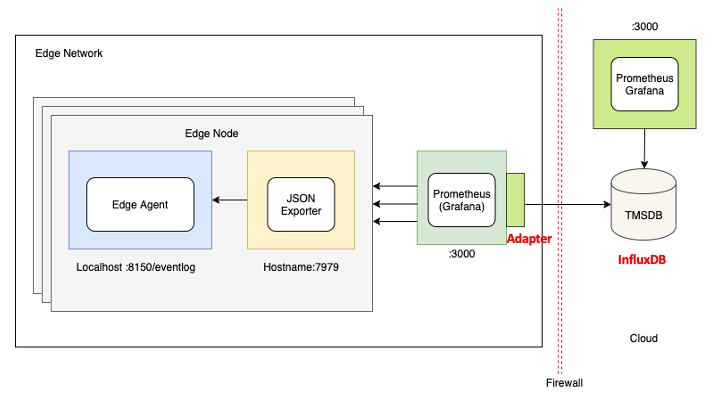
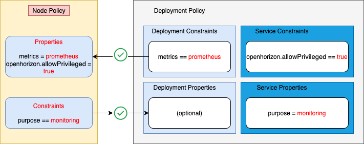

# JSON Exporter Service

This is an example of creating and using an edge exporter service which scrapes JSON by JSONPath for [prometheus](https://prometheus.io/) monitoring

Based on [https://github.com/prometheus-community/json_exporter](https://github.com/prometheus-community/json_exporter)

[1. Preconditions for Using the JSON Exporter Service](#preconditions)

[2. Configuring the JSON Exporter Service](#configuring)

[3. Building and Publishing the JSON Exporter Service](#building)

[4. Using the JSON Exporter Service with Deployment Policy](#using-JSON-exporter)


## <a id=preconditions></a> 1. Preconditions for Using the JSON Exporter Service

If you have not done so already, you must do these steps before proceeding with the JSON Exporter service:

1. Install the Horizon management infrastructure (exchange and agbot).

	*Also see [one-click Management Hub installation example](https://github.com/open-horizon/devops/blob/master/mgmt-hub/README.md)

2. Install the Horizon agent on your edge device and configure it to point to your Horizon exchange.

3. As part of the infrasctucture installation process for IBM Edge Application Manager a file called `agent-install.cfg` was created that contains the values for `HZN_ORG_ID` and the **exchange** and **css** url values. Locate this file and set those environment variables in your shell now:

```bash
eval export $(cat agent-install.cfg)
```

 - **Note**: if for some reason you disconnected from ssh or your command line closes, run the above command again to set the required environment variables.

4. In addition to the file above, an API key associated with your Horizon instance would have been created, set the exchange user credentials, and verify them:

```bash
export HZN_EXCHANGE_USER_AUTH=iamapikey:<horizon-API-key>
hzn exchange user list
```

5. Choose an ID and token for your edge node, create it, and verify it:

```bash
export HZN_EXCHANGE_NODE_AUTH="<choose-any-node-id>:<choose-any-node-token>"
hzn exchange node create -n $HZN_EXCHANGE_NODE_AUTH
hzn exchange node confirm
```

## <a id=configuring></a> 2. Configuring the JSON Exporter Service

You should complete these steps before proceeding building the JSON Exporter service:

1. Clone this git repository:

```bash
cd ~   # or wherever you want
git clone git@github.com:jiportilla/edge_json_exporter.git
cd ~/edge_json_exporter/
```


2. List the event logs for the current or all registrations in the edge device with:

`hzn eventlog list -l`

3. Verify is a valid JSON format, for example:

```json
{
    "record_id": "1",
    "timestamp": "2020-11-03 15:32:35 +0000 UTC",
    "severity": "info",
    "message": "Workload service containers for mycluster/json.exporter are up and running.",
    "event_code": "container_running",
    "source_type": "agreement",
    "event_source": {
      "agreement_id": "f10d230a3dcdd3e6beee137e89f485daeb0da78e27c6eb87589a26b00402242c",
      "workload_to_run": {
        "url": "json.exporter",
        "org": "mycluster",
        "version": "1.0.0",
        "arch": "amd64"
      },
      "dependent_services": [],
      "consumer_id": "IBM/mycluster-agbot",
      "agreement_protocol": "Basic"
    }
  }
```

4. Optionally, update the provided `config.yml` file to define which JSON elements will be exposed by the JSON exporter service using **JSONPath**, for example for messages with **severity=info** use:

```
- name: EventLog
  type: object
  path: $[*]?(@.severity == "info")
  labels:
    environment: edge_development
    id: $.record_id
    source_type: $.source_type
    event_code: $.event_code
    message: $.message
  values:
    info: 1
    timestamp: $.timestamp
```

## <a id=building></a> 3. Building and Publishing the JSON Exporter Service

1. Change directories to the local copy:

```bash
cd ~/edge_json_exporter/
```

2. Set the values in `horizon/hzn/json` to your liking. These variables are used in the service file. They are also used in some of the commands in this procedure. After editing `horizon/hzn.json`, set the variables in your environment:

```bash
export ARCH=$(hzn architecture)
eval $(hzn util configconv -f horizon/hzn.json)
```

3. Build the docker image:

```bash
make build
```
For example, when using the default values provided in this repo [hnz.json](https://github.com/jiportilla/edge_json_exporter/blob/master/horizon/hzn.json) configuration file:
	


```bash
docker build --network="host" -t iportilla/jexporter_amd64:1.0.0 -f ./Dockerfile.amd64 .
```

3. You are now ready to publish your edge service, so that it can be deployed to edge devices. Instruct Horizon to push your docker image to your registry and publish your service in the Horizon Exchange using:

```bash
hzn exchange service publish -f horizon/service.definition.json
hzn exchange service list
```

See [Developing an edge service for devices](https://www-03preprod.ibm.com/support/knowledgecenter/SSFKVV_4.1/devices/developing/developing.html) for additional details.

## <a id=using-JSON-exporter></a> 4. Using the JSON Exporter Service with Deployment Policy

The Horizon Policy mechanism offers an alternative to using deployment patterns. Policies provide much finer control over the deployment placement of edge services. Policies also provide a greater separation of concerns, allowing edge nodes owners, service code developers, and business owners to each independently articulate their own policies. There are three main types of Horizon Policies:

1. Service Policy (may be applied to a published service in the Exchange)
2. Deployment Policy (which approximately corresponds to a deployment pattern)
3. Node Policy (provided at registration time by the node owner)

### Service Policy

Like the other two Policy types, Service Policy contains a set of `properties` and a set of `constraints`. The `properties` of a Service Policy could state characteristics of the Service code that Node Policy authors or Business Policy authors may find relevant. The `constraints` of a Service Policy can be used to restrict where this Service can be run. The Service developer could, for example, assert that this Service requires a particular hardware setup such as CPU/GPU constraints, memory constraints, specific sensors, actuators or other peripheral devices required, etc.


1. Below is the file provided in  `policy/service.policy.json` with this example:

```json
{
  "properties": [
  	 {
      "name": "purpose",
      "value": "monitoring"
    }
  ],
  "constraints": [
       "openhorizon.allowPrivileged == true"
  ]
}
```

- Note this simple Service Policy provides one `property` **purpose=monitoring**, and it states one `constraint`. This JSON Exporter Service `constraint` is one that a Service developer might add, stating that their Service must only be deployed when **openhorizon.allowPrivileged** equals to **true**. After node registration the **openhorizon.allowPrivileged** property will be set to **true**, so this JSON Exportert Service should be compatible with our edge device.

2. If needed, run the following commands to set the environment variables needed by the `service.policy.json` file in your shell:

```bash
export ARCH=$(hzn architecture)
eval $(hzn util configconv -f horizon/hzn.json)
```

3. Next, add or replace the service policy in the Horizon Exchange for this JSON Exporter Service:

```bash
make publish-service-policy
```
For example:

```bash
hzn exchange service addpolicy -f policy/service.policy.json json.exporter_1.0.0_amd64

```

4. View the pubished service policy attached to the **json.exporter** edge service:

```bash
hzn exchange service listpolicy json.exporter_1.0.0_amd64
```

The output should look like:

```json
{
  "properties": [
    {
      "name": "openhorizon.service.url",
      "value": "json.exporter"
    },
    {
      "name": "openhorizon.service.name",
      "value": "json.exporter"
    },
    {
      "name": "openhorizon.service.org",
      "value": "mycluster"
    },
    {
      "name": "openhorizon.service.version",
      "value": "1.0.0"
    },
    {
      "name": "openhorizon.service.arch",
      "value": "amd64"
    },
    {
      "name": "purpose",
      "value": "monitoring"
    }
  ],
  "constraints": [
    "openhorizon.allowPrivileged == true"
  ]
}
```

- Notice that Horizon has again automatically added some additional `properties` to your Policy. These generated property values can be used in `constraints` in Node Policies and Deployment Policies.

- Now that you have set up the published Service policy is in the exchange, we can move on to the next step of defining a Deployment Policy.


### Deployment Policy

Deployment policy (sometimes called Business Policy) is what ties together edge nodes, published services, and the policies defined for each of those, making it roughly analogous to the deployment patterns you have previously worked with.

DeploymentpPolicy, like the other two Policy types, contains a set of `properties` and a set of `constraints`, but it contains other things as well. For example, it explicitly identifies the Service it will cause to be deployed onto edge nodes if negotiation is successful, in addition to configuration variable values, performing the equivalent function to the `-f horizon/userinput.json` clause of a Deployment Pattern `hzn register ...` command. The Deployment Policy approach for configuration values is more powerful because this operation can be performed centrally (no need to connect directly to the edge node).

1. Below is the file provided in  `policy/deployment.policy.json` with this example:

```json
{
  "label": "Deployment policy for $SERVICE_NAME",
  "description": "A super-simple JSON Exporter Service deployment policy",
  "service": {
    "name": "$SERVICE_NAME",
    "org": "$HZN_ORG_ID",
    "arch": "$ARCH",
    "serviceVersions": [
      {
        "version": "$SERVICE_VERSION",
        "priority":{}
      }
    ]
  },
  "properties": [],
  "constraints": [
        "metrics == prometheus"
  ],
  "userInput": [
    {
      "serviceOrgid": "$HZN_ORG_ID",
      "serviceUrl": "$SERVICE_NAME",
      "serviceVersionRange": "[0.0.0,INFINITY)",
      "inputs": [
      ]
    }
  ]
}
```

- This simple example of a Deployment policy provides one `constraint` **metrics** that needs to be satisfied by one of the `properties` set in the `node.policy.json` file, so this Deployment Policy should successfully deploy our JSON Exporter Service onto the edge device.

- At the end, the userInput section has the same purpose as the `horizon/userinput.json` files provided for other examples if the given services requires them. In this case the example service defines does not have configuration variables.

2. If needed, run the following commands to set the environment variables needed by the `deployment policy.json` file in your shell:

```bash
export ARCH=$(hzn architecture)
eval $(hzn util configconv -f horizon/hzn.json)

optional: eval export $(cat agent-install.cfg)
```

3. Publish this Deployment policy to the Exchange to deploy the `json.exporter` service to the edge device (give it a memorable name):


**todo: update Makefile **

```bash
make publish-business-policy
```

For example:

```bash
hzn exchange deployment addpolicy -f policy/deployment.policy.json edge-monitoring

```

4. Verify the Deployment policy:

```bash
hzn exchange deployment listpolicy edge-monitoring
```

- The results should look very similar to your original `deployment.policy.json` file, except that `owner`, `created`, and `lastUpdated` and a few other fields have been added.

**Review ***


```json
{
  "mycluster/edge-monitoring": {
    "owner": "mycluster/ivan",
    "label": "edge-monitoring",
    "description": "with JSON Exporter and prometheus-operator",
    "service": {
      "name": "json.exporter",
      "org": "mycluster",
      "arch": "amd64",
      "serviceVersions": [
        {
          "version": "1.0.0",
          "priority": {},
          "upgradePolicy": {}
        }
      ],
      "nodeHealth": {}
    },
    "constraints": [
      "metrics == prometheus"
    ],
    "created": "2020-11-17T16:38:49.663Z[UTC]",
    "lastUpdated": "2020-11-17T16:38:49.663Z[UTC]"
  }
}
```

- Now that you have set up the Deployment Policy and the published Service policy is in the exchange, we can move on to the final step of defining a Policy for your Edge Node to tie them all together and cause software to be automatically deployed on your edge device.

### Node Policy

- As an alternative to specifying a Deployment Pattern when you register your Edge Node, you may register with a Node Policy.


1. Below is the file provided in `policy/node.policy.json` with this example:

```json
{
  "properties": [
     {
      "name": "metrics",
      "value": "prometheus"
    },
    {
      "name": "openhorizon.allowPrivileged",
      "value": true
    },
  ],
  "constraints": [
  	"purpose == monitoring"
  ]
}
```

- It provides values for two `properties` (**state** and **openhorizon.allowPrivileged**), that will affect which service(s) get deployed to this edge device, and states one `constraint` (**purpose == monitoring**).

The node registration step will be completed in the next section.


( --------- **verify** device registration cmd with policy.json)


```bash
hzn register -policy f horizon/node.policy.json
```
 - **Note**: using the `-s` flag with the `hzn register` command will cause Horizon to wait until agreements are formed and the service is running on your edge node to exit, or alert you of any errors encountered during the registration process.

 
 Publish json service with horizon/service.definition.json
 
 
 Publish deployment policy with *constraint*
 
 ```
 "constraints": [
      "state == configured"
    ],
 ```
 
 

2. After the agreement is made, list the docker container edge service that has been started as a result:

``` bash
sudo docker ps

CONTAINER ID        IMAGE                       COMMAND                  CREATED             STATUS              PORTS                  NAMES
fdf7d0260303        iportilla/jexporter_amd64   "/bin/json_exporter …"   13 days ago         Up 3 minutes                               8060a586134d59c1e4e53d5eac1142475b46bd4a3e1afa675da6689ae0f8749d-json.exporter
```

3. See the Monitoring service output:

``` bash
curl localhost:7979/eventlog
```
 - **Note**: Press **Ctrl C** to stop the command output.

